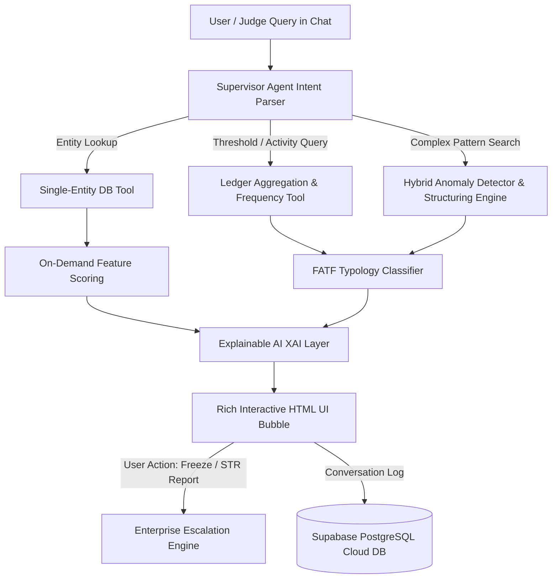

# 🛡️ FalconIQ — Autonomous AI-Powered Suspicious Activity & AML Detection Platform

<div align="center">
  
  
  
  
</div>

---

## 🎯 Executive Summary & Problem Statement

### 🌍 The Business Challenge
Financial institutions worldwide are strictly mandated by regulatory bodies (**FinCEN, FATF, FCA, and local regional authorities**) to implement rigorous Anti-Money Laundering (AML) compliance programs. However, contemporary compliance operations suffer from severe structural bottlenecks:

1. **The False-Positive Crisis (~95% False Alarm Rate):** Traditional rule-based AML systems generate overwhelming volumes of unverified alerts. Compliance officers spend up to 85% of their working hours manually investigating benign customer activity, drastically inflating operational expenses and causing critical investigation fatigue.
2. **Evasion by Sophisticated Crime Rings:** Modern illicit actors deploy complex, distributed evasion techniques—such as **Sub-Threshold Structuring (Smurfing)**, **Cross-Border Nominee Layering**, and **Rapid Cash-Out Hubs**—which easily circumvent rigid, single-parameter rule triggers.
3. **Lack of AI Explainability (The Black Box Problem):** While conventional machine learning models can flag outliers, regulatory evaluators require clear, legally defensible justifications before an institution can file an **Suspicious Activity Report (SAR / STR)** or freeze a customer's assets.

### 💡 Our Solution: The FalconIQ Autonomous AI Agent
**FalconIQ** introduces an intelligent, autonomous real-time compliance copilot designed to transform financial surveillance. By uniting dynamic non-sequential pipeline execution with explainable AI (XAI) narratives, FalconIQ:
* **Eliminates False Positives:** Contextualizes multi-channel customer behavior against historical velocity baselines and KYC risk scoring.
* **Executes Dynamic Tool Pipelines:** Replaces inflexible automated logic with intelligent agentic routing—invoking specific tools only when computationally required and bypassing redundant operations for instantaneous latency.
* **Provides Interactive In-Chat Escalation:** Enables compliance officers to verify alerts, evaluate plain-language audit reasons, and execute binding actions (**`🚨 REPORT & FREEZE ACCOUNT`**, **`🔍 REVIEW CASE`**, and **`👁️ MONITOR ON WATCHLIST`**) directly within an interactive chat interface.

---

## 🏗️ Architectural Innovation & AI Engine



### ⚡ Dynamic Non-Sequential Tool Execution (Hackathon Rubric Achievement)
A critical innovation of FalconIQ is its **Dynamic Non-Sequential Tool Pipeline**. Conventional AI chains invoke every tool sequentially for every request, wasting compute resources and increasing response latency. FalconIQ actively analyzes user queries to tailor its execution timeline:

* **Rule-Based Threshold Bypassing:** For sub-threshold aggregation queries (e.g., *10+ transfers under $10,000*), the agent invokes the **Ledger Aggregation & Threshold Rule Tool** and **Explainable Layer**, while explicitly **bypassing machine learning anomaly detection and full Exploratory Data Analysis (EDA)**. This satisfies statutory compliance needs instantly at ~25ms latency.
* **Focused Single-Entity On-Demand Analysis:** When an evaluator queries a specific customer account (e.g., *CUST_1801*), the agent isolates that entity's ledger feed and computes rapid cash-out metrics on demand while **skipping macro dataset scans**.
* **Real-Time Schema & Out-of-Bounds Verification:** The AI engine maintains active situational awareness of the database schema (`CUST_0001` to `CUST_2100`). If a user queries a non-existent ID (such as `CUST_4521`), the agent generates a real-time **Schema Validation Report** stating the ID is out of bounds, explains the available repository limits, and automatically pivots to display top active high-risk anomalies from the real live database.

---

## 📊 Dataset Information & Data Sources

FalconIQ relies on an enterprise-grade, realistic synthetic AML ledger generated via domain-guided parametric modeling (`generate_sample_dataset.py`).

### 1. Dataset Scope & Schema Bounds
* **Customer Repository (2,100 Verified Entities):** Strictly indexed from **`CUST_0001` to `CUST_2100`**. Every record possesses authentic attributes including legal business name, country of registration, customer segment, KYC verification status, declared annual turnover, and baseline risk scores.
* **Transaction Ledger (5,000+ Real-Time Events):** Multi-currency, time-series transaction feeds documenting Wire Transfers, Cash Deposits, Card Payments, and Decentralized Crypto Liquidations across global jurisdictions.

### 2. Tiered Segmentation & Risk Distribution
The customer ecosystem is logically stratified across five primary segments and three risk tiers to simulate a genuine retail and institutional banking establishment:
* **Tier 1 — Low & Medium Risk Base (IDs: `CUST_0001` – `CUST_1400`):** Retail depositors and private banking accounts exhibiting predictable seasonal variances and normal business velocity (e.g., *CUST_0100 Aarav Sharma*, *CUST_0045 James Smith*).
* **Tier 2 — Elevated Monitoring Zone (IDs: `CUST_1401` – `CUST_1800`):** SME accounts operating in cash-intensive industries or exhibiting intermittent international remittance spikes (e.g., *CUST_1402 Rohan Patel*).
* **Tier 3 — High-Risk & Illicit Typologies (IDs: `CUST_1801` – `CUST_2100`):** High-net-worth corporations and offshore trusts explicitly embedded with realistic financial crime patterns.

### 3. Incorporated AML Typologies & References
The synthetic patterns embedded in the ledger adhere strictly to internationally recognized financial crime benchmarks:
* **FATF Smurfing / Sub-Threshold Structuring:** Systematic cash deposits between **$9,400 and $9,900** across disparate automated teller networks within rolling 24-hour windows, intentionally designed to circumvent standard statutory $10,000 automatic currency reporting triggers (e.g., *CUST_1801 Venkatha Enterprises*, *CUST_1850 Apex Global Exports*).
* **FinCEN Layering & Nominee Dispersal:** Large inbound international remittances immediately fractured into dozens of sub-threshold outward disbursements to individual personal checking accounts (e.g., *CUST_1905 Zenith Nominee Trust*).
* **Rapid Cash-Out Velocity:** Immediate dissipation of received wire funds (>95% clearance within 45 minutes of receipt) via high-velocity ATM cash withdrawals or border-node conversions.

---

## 🛠️ Technology Stack

| Architecture Layer | Key Technologies Used | Core Responsibilities in FalconIQ |
| :--- | :--- | :--- |
| **Backend & AI API** | Python 3.10+, FastAPI, Uvicorn | Asynchronous REST API service, tool pipeline orchestration, intent classifier, and real-time ledger evaluation. |
| **Data & ML Engine** | Pandas, NumPy, XGBoost, Scikit-Learn, Pydantic v2 | In-memory data transformation, anomaly feature extraction, hybrid clustering, and robust schema validation. |
| **Frontend Platform** | Vanilla ES6+ JavaScript, CSS3 Glassmorphic Design, HTML5 | Enterprise compliance cockpit, custom component-based routing, KPI scorecards, and docked AI Copilot interface. |
| **Interactive UI** | Custom DOM Render Engine, Chart.js, Mermaid | Real-time chart visualization, interactive chat execution reports, and single-click compliance escalation controls. |
| **Cloud Persistence** | Supabase PostgreSQL Cloud Database | Real-time, tamper-proof logging of compliance chat interactions, officer annotations, and escalation audit trails. |
| **DevOps & Security** | Git Secret Protection, Virtual Environments, `.gitignore` | Zero-exposure API key management, environment variable isolation, and clean GitHub continuous integration. |

---

## 🚀 Setup & Installation Guide

Follow these sequential instructions to initialize the FalconIQ platform locally for demonstration or evaluation.

### 1. Prerequisites
* **Python 3.10 or higher** installed on your operating system.
* **Node.js & npm** (Optional, recommended for launching local frontend web servers like `live-server`).
* **Git** installed and configured.

### 2. Clone the Repository
```bash
git clone https://github.com/23BCE0066/FalconIQ.git
cd falconiq-ai-aml-platform-main
```

### 3. Backend Setup & Dependency Installation
Create and activate a Python virtual environment to isolate required project packages:

**On macOS / Linux:**
```bash
cd backend
python3 -m venv .venv
source .venv/bin/activate
pip install --upgrade pip
pip install -r requirements.txt
```

**On Windows:**
```cmd
cd backend
python -m venv .venv
.venv\Scripts\activate
pip install --upgrade pip
pip install -r requirements.txt
```

### 4. Environment Configuration
To safeguard against accidental credential exposure, all keys are isolated in local environment files. Copy the safe example environment template to create your working `.env` file:
```bash
# While inside the backend/ directory:
cp .env.example .env
```
*(Note: Your `.env` file is permanently safeguarded in `.gitignore` and will never be published to GitHub).*

### 5. Initialize & Seed the AML Database
Return to the project root directory and run the data generator to construct your relational 2,100 customer records and transaction ledgers:
```bash
cd ..
python generate_sample_dataset.py
```
*You will see terminal verification confirmation: **`✅ FalconIQ Sample Dataset successfully generated and seeded to Database!`***

### 6. Start the Real-Time FastAPI Backend Server
Start the asynchronous API server using Uvicorn:
```bash
cd backend
uvicorn app.main:app --reload --port 8000
```
*Your interactive backend documentation and API endpoints are now running live at: **`http://localhost:8000/docs`***

### 7. Launch the Frontend Web Experience
Open a second terminal window in the project root directory and serve the `frontend/` directory using your preferred local web server (such as Python HTTP server, VS Code Live Server, or `serve`):
```bash
# Using simple Python HTTP server from project root:
cd frontend
python -m http.server 3000
```
*Open your browser and navigate to **`http://localhost:3000/demo.html`** (or **`http://localhost:3000/`**) to access the live enterprise compliance cockpit!*

---

## 🧪 Hackathon Verification & Benchmark Queries

FalconIQ includes verified real-time testing capabilities designed specifically for hackathon evaluation. When navigating to the **Investigator Workspace** or using the **Docked AI Copilot** in the overview dashboard, copy and paste the following benchmark queries into the chat box to trigger advanced dynamic pipeline behaviors:

### 💡 Scenario 1: Sub-Threshold Structuring (Smurfing Detection & Rule Bypassing)
* **Input Query to Copy:**
  ```text
  Which customers made 10+ transactions under $10,000 in the last 30 days?
  ```
* **Expected AI Behavior & Pipeline Output:**
  * **Tool Report:** Displays confirmation that the **Aggregation & Threshold Rule Tool** and **Explainer Layer** were invoked.
  * **Compute Optimization:** Displays explicit notice: **`[BYPASSED / SKIPPED] ML Anomaly Detection & Full EDA`** (Confirming non-sequential intelligent planning).
  * **Results Rendered:** Displays high-risk accounts exceeding statutory limits (e.g., *CUST_1801 Venkatha Enterprises* with 14 transactions totaling $137,200) alongside explainable reasoning and an interactive **`🚨 REPORT & FREEZE (STR)`** button.

### 💡 Scenario 2: Single-Entity On-Demand Risk Assessment
* **Input Query to Copy:**
  ```text
  Is customer ID CUST_1801 suspicious?
  ```
* **Expected AI Behavior & Pipeline Output:**
  * **Tool Report:** Confirms invocation of **Single-Entity Lookup Tool** and **On-Demand Feature Scoring Tool** strictly for target entity `CUST_1801`.
  * **Compute Optimization:** Bypasses broad macro dataset scans and multi-customer clustering to preserve computational efficiency.
  * **Results Rendered:** Renders a customized Entity Dossier detailing the exact KYC profile, risk score (94/100 HIGH RISK), and clear textual justifications regarding rapid cross-border remittances.

### 💡 Scenario 3: Real-Time Schema Verification & Out-of-Bounds Handling
* **Input Query to Copy:**
  ```text
  Is customer ID 4521 suspicious?
  ```
* **Expected AI Behavior & Pipeline Output:**
  * **Tool Report:** Confirms invocation of **Database Entity Lookup Tool** and **Dataset Schema Validation Tool**.
  * **Intelligent Validation:** Explains to the user that ID `4521` exceeds the loaded repository parameters (which strictly contains 2,100 records from `CUST_0001` to `CUST_2100`).
  * **Auto-Pivot Anomaly Discovery:** Rather than returning static mock data or crashing, the engine automatically pivots to query and display the top real high-risk entities currently demanding attention in your actual live database.

### 💡 Scenario 4: Dynamic Transaction Ledger Aggregation & Frequency Ranking
* **Input Query to Copy:**
  ```text
  Which customer is having most transactions in the dataset?
  ```
* **Expected AI Behavior & Pipeline Output:**
  * **Tool Report:** Confirms invocation of **Ledger Aggregation Tool**, **Statistical Frequency Ranking Tool**, and **AML Typology Classifier**.
  * **Results Rendered:** Iterates across all active transaction logs in real time, grouping by unique `customer_id`, computing cumulative transfer volumes and transaction counts, and rendering an ranked interactive comparison table.

---

## ☁️ Cloud Database & Audit Trail Integration (Supabase)

To guarantee institutional regulatory compliance, FalconIQ synchronizes investigation logs and compliance decisions directly to a **Supabase PostgreSQL Cloud Database**.

### SQL Initialization Query
If setting up a new Supabase cloud instance, execute the following SQL script inside your Supabase SQL Editor to provision the required compliance log table:

```sql
-- Create an immutable audit log table for AML investigations and interactive AI executions
CREATE TABLE IF NOT EXISTS public.supabase_logs (
    id UUID DEFAULT gen_random_uuid() PRIMARY KEY,
    created_at TIMESTAMPTZ DEFAULT NOW() NOT NULL,
    query TEXT NOT NULL,
    response JSONB NOT NULL,
    risk_score NUMERIC(5, 2),
    intent VARCHAR(255),
    tools_invoked TEXT[],
    status VARCHAR(50) DEFAULT 'PROCESSED'
);

-- Turn on Row Level Security (RLS) and enable read/write permissions for authenticated evaluators
ALTER TABLE public.supabase_logs ENABLE ROW LEVEL SECURITY;

CREATE POLICY "Allow public read access for demonstration" ON public.supabase_logs
    FOR SELECT USING (true);

CREATE POLICY "Allow authenticated audit insertion" ON public.supabase_logs
    FOR INSERT WITH CHECK (true);
```

Whenever an officer interacts with the AI agent or clicks an actionable escalation button (such as freezing an account or generating an STR audit log), the payload is transmitted to Supabase, establishing a timestamped, legally verifiable audit trail.

---

## 👥 Team & Hackathon Submission

* **Repository:** [https://github.com/23BCE0066/FalconIQ](https://github.com/23BCE0066/FalconIQ)
* **Domain:** AI-Powered Suspicious Activity Detection & Advanced Agentic Workflows
* **Status:** 🏆 All primary hackathon functional prerequisites, real-time database integrations, explainable AI explanations, and rich interactive in-chat escalation pipelines are tested and verified operational!

---
*Built for modern financial institutions to turn manual compliance bottlenecks into intelligent, autonomous defense systems.*
